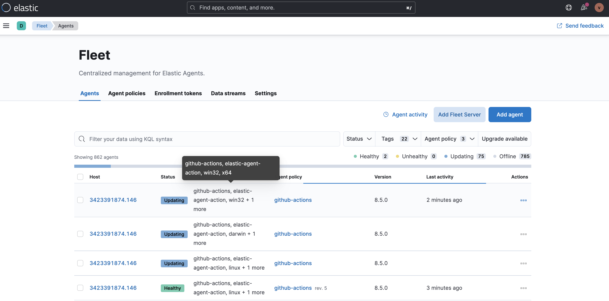

[](https://github.com/v1v/elastic-agent-action/releases/latest)
[](https://github.com/v1v/elastic-agent-action/actions?workflow=ci)
[](https://github.com/v1v/elastic-agent-action/actions?workflow=test)
[](https://codecov.io/gh/v1v/elastic-agent-action)

___

**NOTE:** This repository is still under active development.
___

## About

GitHub Action to install [Elastic Agent](https://www.elastic.co/elastic-agent) to add monitoring for logs, metrics, and other types of data to the GitHub runner.

___

* [Usage](#usage)
  * [Configuration](#configuration)
* [Customizing](#customizing)
  * [inputs](#inputs)
* [Keep up-to-date with GitHub Dependabot](#keep-up-to-date-with-github-dependabot)
* [Fleet UI](#fleet-ui)

## Usage

### Configuration

To authenticate against [Fleet Server](https://www.elastic.co/guide/en/fleet/current/fleet-server.html).

```yaml
name: ci

on:
  push:
    branches: main

jobs:
  elastic-agent:
    runs-on: ubuntu-latest
    steps:
      -
        name: Install and Configure Elastic agent
        uses: v1v/elastic-agent-action@main
        with:
          fleetUrl: ${{ secrets.FLEET_URL }}
          enrollmentToken: ${{ secrets.FLEET_ENROLLMENT_TOKEN }}
          version: "8.4.3"
```

## Customizing

### inputs

Following inputs can be used as `step.with` keys

| Name              | Type    | Default                     | Description                        |
|-------------------|---------|-----------------------------|------------------------------------|
| `fleetUrl`        | String  |                             | Server address of Fleet Server.    |
| `enrollmentToken` | String  |                             | Enrollment token used to log against the Fleet Server |
| `version`         | String  | `latest`                    | What Elastic Agent to be installed. Will default to get the latest release. |
| `agentName`       | String  | `${GITHUB_RUN_NUMBER}.${GITHUB_RUN_ID}` | What Elastic Agent name. If empty, it will use the current hostname. |
| `logout`          | Bool    | `true`                      | Log out from the Fleet Server at the end of a job |

## Keep up-to-date with GitHub Dependabot

Since [Dependabot](https://docs.github.com/en/github/administering-a-repository/keeping-your-actions-up-to-date-with-github-dependabot)
has [native GitHub Actions support](https://docs.github.com/en/github/administering-a-repository/configuration-options-for-dependency-updates#package-ecosystem),
to enable it on your GitHub repo all you need to do is add the `.github/dependabot.yml` file:

```yaml
version: 2
updates:
  # Maintain dependencies for GitHub Actions
  - package-ecosystem: "github-actions"
    directory: "/"
    schedule:
      interval: "daily"
```

## Fleet UI

Every single runner will be presented as below in the Elastic Fleet UI.


